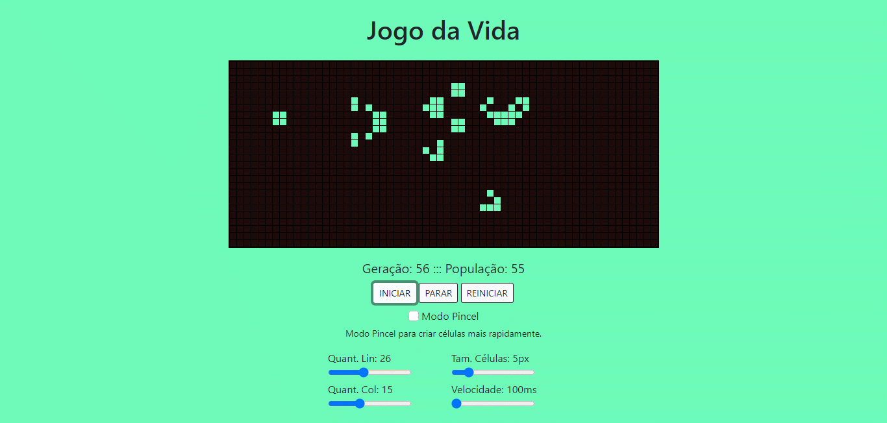

# Jogo da Vida
Jogo desenvolvido pelo matemático John Horton Conway.

|  |
|-|
| *Transposição Triangular* |

[Acesse o jogo](https://davidgomesh.github.io/jogo-da-vida-js/)

## Regras do Jogo
1. Qualquer célula viva com menos de dois vizinhos vivos morre de solidão.
2. Qualquer célula viva com mais de três vizinhos vivos morre de superpopulação.
3. Qualquer célula morta com exatamente três vizinhos vivos se torna uma célula viva.
4. Qualquer célula viva com dois ou três vizinhos vivos continua no mesmo estado para a próxima geração.
